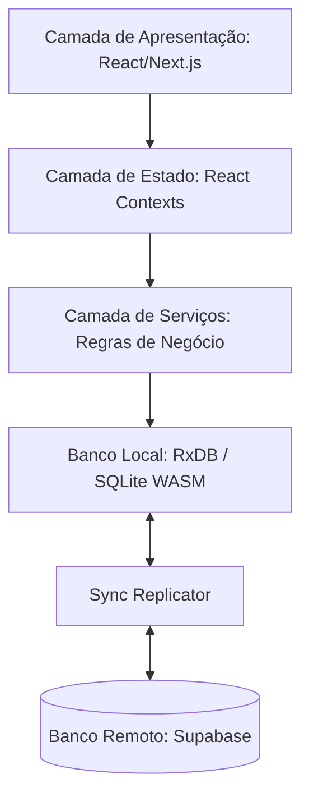

# Arquitetura do Sistema

O **GymAux** é projetado como um Progressive Web App (PWA) **Offline-First**. O objetivo principal é garantir que o usuário consiga registrar e gerenciar seus treinos mesmo sem conectividade com a internet, sincronizando os dados com o servidor de forma transparente quando a conexão for restabelecida.

---

## Estrutura de Camadas



### 1. Apresentação (UI)
* **Tecnologia:** Next.js App Router, Tailwind CSS v4, Framer Motion.
* **Componentes:** Divisão clara entre *Server Components* (otimização e carregamento inicial) e *Client Components* (interação local de treino).

### 2. Estado (React Contexts)
* **Objetivo:** Prover estados reativos para fluxos complexos (ex: sessão ativa de treino, histórico de execuções).
* **Localização:** `src/context/`

### 3. Serviços (Lógica de Negócio)
* **Objetivo:** Isolar o acesso a dados. Os componentes ou contextos não acessam o banco de dados diretamente; consomem classes de serviço isoladas.
* **Localização:** `src/services/`

### 4. Persistência e Sincronização
* **Local (RxDB / SQLite WASM):** Banco de dados relacional reativo no cliente que atua como única fonte de verdade para a interface do usuário.
* **Sincronização (Sync Replicator):** Protocolo de replicação bidirecional contínuo rodando no cliente que sincroniza mudanças incrementais via API do Supabase.
* **Remoto (Supabase):** Banco de dados relacional de nuvem persistente (PostgreSQL).

---

## Estrutura de Pastas Principal

```bash
src/
├── app/          # Roteamento internacionalizado (App Router)
│   └── [locale]/ # Subpastas (auth) e (private) com fluxos específicos
├── components/   # UI Reutilizável (design system e layouts)
├── config/       # Schemas do RxDB, inicialização do banco, sementes e tipos
├── context/      # Provedores de estado e reatividade da aplicação
├── hooks/        # Hooks utilitários e hooks de gerenciamento de sessão/UI
├── lib/          # Wrappers de SDKs (Supabase client/server) e utilitários
├── services/     # Serviços de domínio (workouts, history, rxReplication)
└── utils/        # Funções puras auxiliares
```
