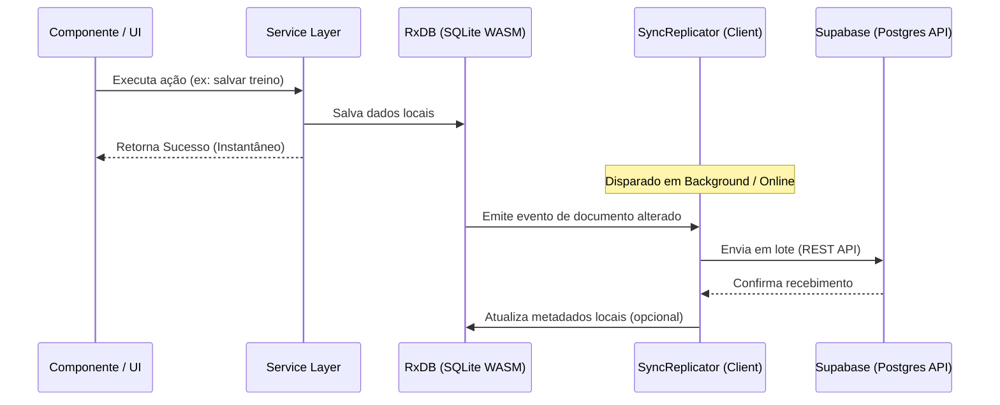

# Padrões de Projeto e Práticas

Os seguintes padrões arquiteturais guiam o desenvolvimento do **GymAux** para manter o código testável, desacoplado e eficiente.

---

## 1. Padrão Offline-First & Replicação Nativa

Toda alteração ou leitura de dados é executada diretamente no banco de dados local **RxDB (SQLite WASM / IndexedDB)**. O RxDB gerencia a consistência local e delega a transmissão dos dados para o **SyncReplicator**.

* **Resiliência a Falhas:** Se o usuário estiver offline, a replicação entra em estado de espera automaticamente. A fila de escrita offline é persistida no SQLite local. Ao reestabelecer conexão, o RxDB sincroniza os pacotes em atraso em lotes de forma transacional.
* **Redução de Código Boilerplate:** A replicação nativa do RxDB elimina a necessidade de gerenciar filas de sincronização e retentativas manuais na camada de aplicação.

---

## 2. Camada de Serviço (Service Layer Pattern)

Os componentes e provedores de estado (Contexts) nunca invocam diretamente as funções do RxDB ou chamadas de API do Supabase. Toda a lógica de negócio e persistência reside em classes de serviço estáticas (`src/services/`).

* **Exemplo de Fluxo:**
  1. O usuário clica em "Salvar Workout".
  2. O contexto chama `WorkoutService.createWorkout(...)`.
  3. O `WorkoutService` insere o dado no banco local `db.workouts` via RxDB API. A replicação bidirecional do RxDB encarrega-se do envio assíncrono para o Supabase.

---

## 3. Reatividade de Dados Baseada em Observables (RxJS)

Para manter a interface atualizada em tempo real (reatividade offline-first), utilizamos as streams de dados (Observables) nativas do RxDB:
* **Subscrição Reativa:** Os componentes reagem instantaneamente às mutações locais assinando os queries observables do RxDB (ex: `query.$.subscribe()`).
* **Performance:** Reduz-se re-renderizações desnecessárias ao utilizar filtros refinados na query SQL do cliente, mantendo o ciclo de renderização do React sincronizado ao ciclo do banco de dados local de forma eficiente.

---

## 4. Roteamento Internacionalizado e Agrupamento de Rotas

Utilizamos os recursos avançados de roteamento do Next.js App Router:
* **Roteamento de Idiomas:** O diretório dinâmico `[locale]/` encapsula todo o fluxo de páginas. O middleware dinâmico do `next-intl` intercepta as requisições para determinar o idioma do usuário.
* **Route Groups (Grupos de Rota):** As rotas são organizadas semanticamente por `(auth)` (fluxos não logados) e `(private)` (fluxos protegidos). Dentro de privado, as permissões são divididas entre `(user)` e `(trainer)`.
